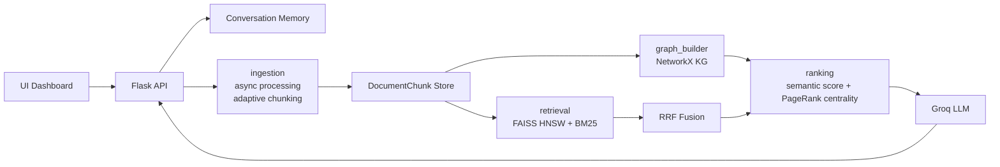

# KnowledgeGraphRAG v3.0

Research-grade Graph RAG for heterogeneous business documents. The system combines adaptive semantic chunking, FAISS HNSW dense search, BM25 lexical retrieval, reciprocal rank fusion, graph centrality ranking, conversation memory, source citations, and an interactive knowledge graph.

## Architecture



## Modular Layout

| Module | Responsibility |
|---|---|
| `graph_rag/ingestion.py` | Async document processing, spreadsheet ingestion, adaptive semantic chunking |
| `graph_rag/retrieval.py` | FAISS HNSW dense retrieval, BM25, RRF |
| `graph_rag/graph_builder.py` | Entity extraction and typed weighted NetworkX graph construction |
| `graph_rag/ranking.py` | Confidence-aware ranking with semantic score and graph centrality |
| `graph_rag/memory.py` | Conversation memory and multi-turn query rewriting |
| `graph_rag/api/system.py` | End-to-end orchestration facade |
| `app.py` | Flask API and dashboard host |
| `templates/index.html` | Modern dashboard UI |

`graph_rag_system.py` remains as a compatibility shim, so old imports still work:

```python
from graph_rag_system import KnowledgeGraphRAG
```

## Key Architectural Improvements

1. **Hybrid retrieval**: Dense vector search and BM25 keyword search run independently, then merge with Reciprocal Rank Fusion. This avoids brittle score-scale tuning between cosine similarity and BM25.
2. **FAISS HNSW**: The dense index uses `IndexHNSWFlat` with inner product over normalized embeddings for faster approximate search at larger corpus sizes.
3. **Adaptive semantic chunking**: Text is split at page, paragraph, heading and sentence boundaries with soft length targets instead of fixed character windows.
4. **Confidence-aware ranking**: Final score blends RRF evidence, dense semantic similarity, normalized lexical evidence and PageRank centrality from the graph.
5. **Conversation memory**: Multi-turn context is stored per `conversation_id` and folded into follow-up retrieval.
6. **Graph-augmented context**: Retrieved chunks seed graph traversal; nearby source chunks are added before answer generation.
7. **Incremental performance**: File fingerprints cache document chunks and embedding arrays; rebuilds only recompute changed corpora.
8. **Simple production-style UI**: Upload, chat, graph, stats, confidence, and citations are exposed through a clean Tyrian-purple dashboard.

## Database Schema

The current local runtime stores state in memory and versioned pickle caches. The graph can be exported to Neo4j with the following logical schema.

### Relational/Analytical Schema

```sql
CREATE TABLE documents (
  id TEXT PRIMARY KEY,
  source TEXT NOT NULL,
  source_path TEXT,
  file_type TEXT,
  document_type TEXT,
  fingerprint TEXT,
  created_at TIMESTAMP DEFAULT CURRENT_TIMESTAMP
);

CREATE TABLE chunks (
  id TEXT PRIMARY KEY,
  document_id TEXT REFERENCES documents(id),
  chunk_index INTEGER NOT NULL,
  text TEXT NOT NULL,
  metadata JSON,
  structured_data JSON
);

CREATE TABLE embeddings (
  chunk_id TEXT PRIMARY KEY REFERENCES chunks(id),
  model_name TEXT NOT NULL,
  vector BLOB NOT NULL
);

CREATE TABLE entities (
  id TEXT PRIMARY KEY,
  name TEXT NOT NULL,
  type TEXT NOT NULL,
  source TEXT,
  source_file TEXT,
  attributes JSON
);

CREATE TABLE relationships (
  source_entity_id TEXT REFERENCES entities(id),
  target_entity_id TEXT REFERENCES entities(id),
  type TEXT NOT NULL,
  strength REAL DEFAULT 1.0,
  description TEXT,
  PRIMARY KEY (source_entity_id, target_entity_id, type)
);

CREATE TABLE conversations (
  id TEXT PRIMARY KEY,
  created_at TIMESTAMP DEFAULT CURRENT_TIMESTAMP
);

CREATE TABLE turns (
  id INTEGER PRIMARY KEY AUTOINCREMENT,
  conversation_id TEXT REFERENCES conversations(id),
  query TEXT NOT NULL,
  answer TEXT NOT NULL,
  created_at TIMESTAMP DEFAULT CURRENT_TIMESTAMP
);
```

### Neo4j Schema

```cypher
(:Entity {id, name, type, source})
(:DocumentNumber)-[:SAME_DOCUMENT]->(:SupplierName)
(:DocumentNumber)-[:SAME_DOCUMENT]->(:Amount)
(:SupplierName)-[:SAME_SUPPLIER]->(:SupplierName)
(:InvoiceNumber)-[:SAME_INVOICE_NUMBER]->(:DocumentNumber)
```

## API Documentation

### `POST /api/query`

Request:

```json
{
  "query": "What is the total invoice amount for supplier X?",
  "conversation_id": "optional-session-id"
}
```

Response includes:

```json
{
  "success": true,
  "intent": "AGG",
  "confidence": "HIGH",
  "answer": "...",
  "sources": [{ "citation": "invoice.pdf#0", "confidence_score": 0.91 }]
}
```

### Endpoints

| Endpoint | Method | Purpose |
|---|---:|---|
| `/` | GET | Dashboard |
| `/api/query` | POST | Full RAG answer with memory and metrics |
| `/api/search` | POST | Retrieval-only source ranking |
| `/api/upload` | POST | Upload files and rebuild index |
| `/api/graph-data` | POST | Query-relevant graph nodes/edges |
| `/api/stats` | GET | Corpus, graph and index stats |
| `/api/history/<conversation_id>` | GET | Chat history |
| `/api/history/<conversation_id>` | DELETE | Clear chat history |
| `/api/reload` | POST | Rebuild indexes from disk |
| `/api/clear-cache` | POST | Clear caches and rebuild |
| `/api/health` | GET | Health check |

## Quick Start

```bash
python -m venv .venv
.venv\Scripts\activate
pip install -r requirements.txt
python app.py
```

Open `http://localhost:5001`.

Optional LLM answers:

```bash
echo GROQ_API_KEY=your_key_here > .env
```

Without `GROQ_API_KEY`, the system still performs retrieval and returns grounded context previews.

## Testing

```bash
pytest
```

The included tests cover semantic chunking, BM25 and RRF. Add integration tests with a small fixture corpus before deploying to a shared environment.

## Migration Guide

### From v2 single-file code

Old:

```python
from graph_rag_system import KnowledgeGraphRAG
rag = KnowledgeGraphRAG(api_key)
rag.build_system("data/excel", "data")
```

Still valid. New preferred import:

```python
from graph_rag import KnowledgeGraphRAG
```

### Query API changes

`search_and_answer(query)` now accepts:

```python
rag.search_and_answer(
    query="Find invoice totals",
    conversation_id="finance-review"
)
```

The response now includes `sources`, `chat_history` and score components per source.

### UI changes

The Bootstrap page has been replaced by a standalone dashboard with:

- chat history
- dark/light mode
- drag-and-drop upload
- source citation panel
- confidence bars
- interactive graph visualization

### Cache changes

Cache version is now `3.0`. Old pickle cache entries are ignored automatically. Use `/api/clear-cache` if you want a clean rebuild.
